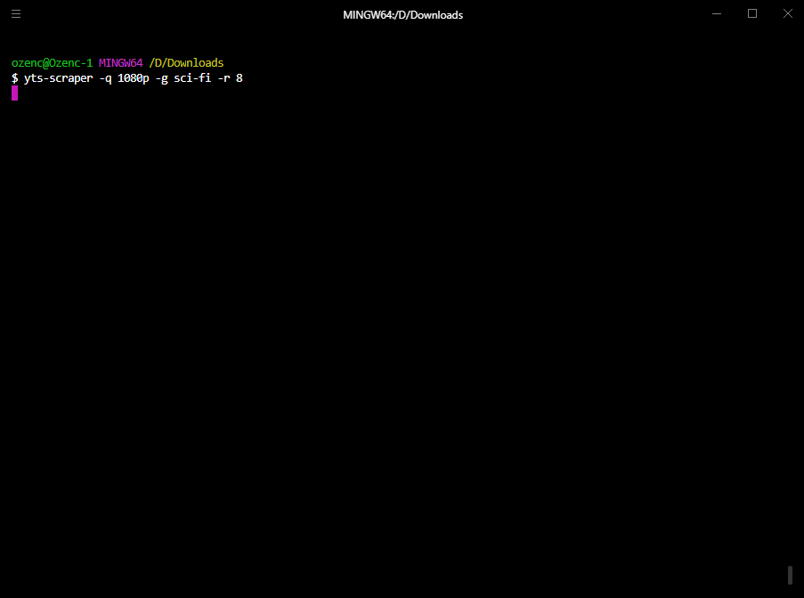

# YTS Scraper

## Description
**yts-scraper** is a command-line tool for downloading .torrent files from YTS. 
It requires Python 3.0+.
Note that this tool does not download the contents of a torrent file but downloads files with .torrent extension.
You should use a Torrent client to open these files. 

## Installation
Make sure that setuptools is installed on your system before running setup.

Linux:
`sudo apt-get install python3-setuptools`

Windows:
`pip install setuptools`

Then you can run `python setup.py install` to install YTS-Scraper on your system.

## Usage
To start scraping run:

`yts-scraper [OPTIONS]`

For instance, running this command would download every 1080p sci-fi movie and their posters with an IMDb score of 8 or higher, and store them in rating>genre structured subdirectories.

`yts-scraper -q 1080p -g sci-fi -r 8 -c rating-genre -b`

## Options

| Commands                          | Description                                                                                                                          |
|-----------------------------------|--------------------------------------------------------------------------------------------------------------------------------------|
|`-h` or `--help`           |Prints help text. Also prints out all the available optional arguments.                                                                       |
|`-o` or `--output`         |Output directory                                                                                                                              |
|`-b` or `--background`     |Append "-b" to download movie posters. This will pack .torrent file and the image together in a folder.                                       |
|`-q` or `--quality`        |Video quality. Available options are: "all", "720p", "1080p", "3d"                                                                            |
|`-g` or `--genre`          |Movie genre. Available options are: "all", "action", "adventure", "animation", "biography", "comedy", "crime", "documentary", "drama", "family", "fantasy", "film-noir", "game-show", "history", "horror", "music", "musical", "mystery", "news", "reality-tv", "romance", "sci-fi", "sport", "talk-show", "thriller", "war", "western".                                              |
|`-r` or `--rating`         |Minimum rating score. Enter an integer between 0 and 9.                                                                                       |
|`-s` or `--sort-by`        |Download order. Available options are: "title", "year", "rating", "latest", "peers", "seeds", "download_count", "like_count", "date_added"    |
|`-c` or `--categorize-by`  |Creates a folder structure. Available options are: "rating", "genre", "rating-genre", "genre-rating"                                          |
|`-p` or `--page`           |Can be used to skip ahead an amount of pages.                                                                                                 |

## Disclaimer
This is a proof of concept tool built mainly to practice programming.
The tool downloads thousands of torrent files in bulk and some of these torrent files might be leading to copyrighted material.
Although the downloaded files are not the contents themselves, accessing or storing these files might still be illegal in some parts of the world. So, take great care when using this tool and make sure that it is legal.